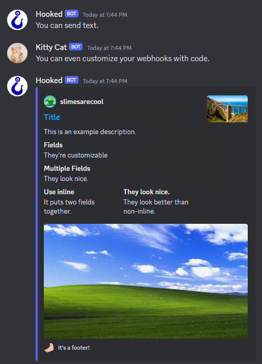

# Hooked
Hooked is a simple easy to use library for making discord webhooks in lua. Although webhooks aren't generally hard to do, sending web requests in lua are hard. I spent hours finding a way to do it. I decided to package it up into hooked for the general public to use


## Installation
Download the source code and then download luavit from here: https://luvit.io/install.html. Once both pieces of code are installed run: ```luavit example.lua``` and it will run just fine. The example file has tons of comments to help you. Since it's a small library you can read the source or the example, so there is no wiki.

## Help
If you need help you can join the discord server here: https://discord.gg/5WCkunrvvT.